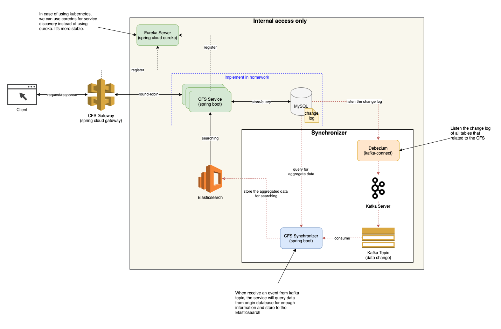
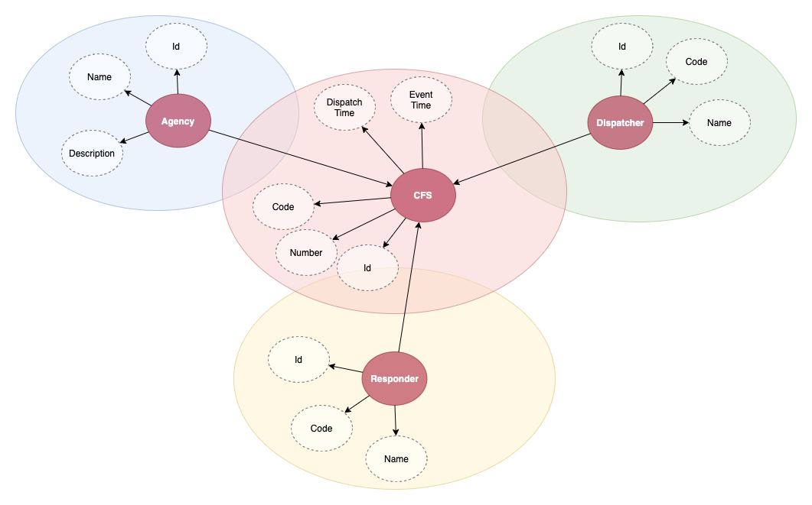
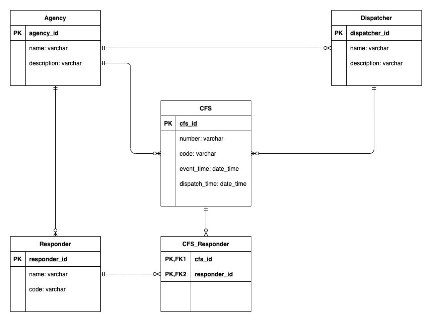

# CFS Service
The service that helps to manage the CFS events.

## System Overview


## Data Models


## Database Design


## Project Structure
```bash
├── Dockerfile
├── HELP.md
├── README.md
├── entrypoint.sh
├── img
│   ├── cfs-data-model.png
│   ├── cfs-database-diagram.png
│   └── cfs-system.png
├── mvnw
├── mvnw.cmd
├── pom.xml
└── src
    ├── main
    │   ├── java
    │   │   └── com
    │   │       └── exercise
    │   │           └── cfs
    │   │               ├── Application.java
    │   │               ├── config
    │   │               │   ├── CustomExceptionHandler.java
    │   │               │   └── SwaggerConfig.java
    │   │               ├── controller
    │   │               │   └── CFSController.java
    │   │               ├── dto
    │   │               │   ├── CFSDto.java
    │   │               │   ├── ErrorResponse.java
    │   │               │   ├── Order.java
    │   │               │   ├── Page.java
    │   │               │   ├── PageResponse.java
    │   │               │   ├── Sort.java
    │   │               │   └── TimeRange.java
    │   │               ├── exception
    │   │               │   └── CFSException.java
    │   │               ├── model
    │   │               │   ├── Agency.java
    │   │               │   ├── CallForService.java
    │   │               │   ├── Dispatcher.java
    │   │               │   └── Responder.java
    │   │               ├── repository
    │   │               │   ├── AgencyRepository.java
    │   │               │   ├── CallForServiceRepository.java
    │   │               │   ├── DispatcherRepository.java
    │   │               │   └── ResponderRepository.java
    │   │               ├── service
    │   │               │   ├── CFSService.java
    │   │               │   └── DataGeneratorService.java
    │   │               └── util
    │   │                   └── DateFormatUtil.java
    │   └── resources
    │       └── application.yml
    └── test
        ├── java
        │   └── com
        │       └── exercise
        │           └── cfs
        │               ├── ApplicationTests.java
        │               └── service
        │                   └── CFSServiceTest.java
        └── resources
            └── application.yml

```

## Dependencies
```
spring-boot-starter-web
spring-boot-starter-data-jpa
spring-boot-starter-actuator
micrometer-registry-prometheus
springfox-swagger2
spring-boot-starter-test
```

## How To Run
### Generated data for testing
By adding the following param for starting command, the service will generate some data items for testing. <br/>
Note: by scope of homework, I use h2 database for storing the CFS events.
```bash
-Ddata.generate=true
```
The generated data (cfs event) as the following table

| number | code | event_time | dispatch_time | dispatcher_id |
| -- | -- | -- | -- | -- |
| 3234019 | SMO | 2021-01-10 07:36:04 | 2021-01-10 10:30:00 | 85e9f816-ebb3-4626-a684-17746f39eee3 |
| 3234775 | CAR | 2021-01-13 08:10:05 | 2021-01-13 08:15:00 | 85e9f816-ebb3-4626-a684-17746f39eee3 |
| 3234842 | PUB | 2021-01-17 10:00:05 | 2021-01-17 11:15:00 | 85e9f816-ebb3-4626-a684-17746f39eee3 |

### Starting by java command line
Build the project
```bash
mvn clean package
```
Run the service
```bash
java -Ddata.generate=true -jar target/cfs-0.0.1-SNAPSHOT.jar
```

### Starting by docker
Build the project
```bash
mvn clean package
```
Dockerize the service
```bash
docker build -t cfs-service .
```
Run the service
```bash
docker run -p 8080:8080 -d --name cfs-service cfs-service
```

### Testing the API
URL
```
http://localhost:8080/api/cfs
```

Method
```
GET
```
Parameters
| Name | Type | Require | Default value | Description |
| -- | -- | -- | -- | -- |
| dispatcherId | UUID | x  | - | Get from the sample data |
| fromTime | String | | null | Format: yyyy-MM-dd HH:mm:ss |
| toTime | String | | null | Format: yyyy-MM-dd HH:mm:ss |
| pageNum | Integer | | 0 | - |
| pageSize | Integer | | 10 | - |
| sortBy | String | | eventTime | Available values: number, code, eventTime, dispatchTime |
| sortOrder | String | | asc | Available values: asc, desc |


Sample request
```bash
curl -X GET "http://localhost:8080/api/cfs?dispatcherId=85e9f816-ebb3-4626-a684-17746f39eee3&fromTime=2021-01-13%2000%3A00%3A00&toTime=2021-01-20%2000%3A00%3A00&pageNum=0&pageSize=10&sortBy=eventTime&sortOrder=asc" 
```
Sample response
```json
{
  "totalElements": 2,
  "totalPages": 1,
  "content": [
    {
      "id": "1fa7997c-050f-478e-9d71-8f37f12ee6dc",
      "number": "3234775",
      "code": "CAR",
      "eventTime": "2021-01-13T01:10:05.000+00:00",
      "dispatchTime": "2021-01-13T01:15:00.000+00:00"
    },
    {
      "id": "e4ad1d93-b5d9-4981-8aad-d3a19c58e0dd",
      "number": "3234842",
      "code": "PUB",
      "eventTime": "2021-01-17T03:00:05.000+00:00",
      "dispatchTime": "2021-01-17T04:15:00.000+00:00"
    }
  ]
}
```


### Production Monitoring
To make sure the production always up, there are some metrics need to be checked in every seconds.

| Metric | Endpoint | Expect | Description |
| -- | -- | -- | -- |
| health | /actuator/health | Status UP | Check and know that the service is Up or DOWN |
| tomcat_threads_current_threads | /actuator/prometheus | < 200 | The value should be < tomcat_threads_config_max_threads.<br/> By default is 200.<br/> When reach the max config, the service can be scaled more instances.|
